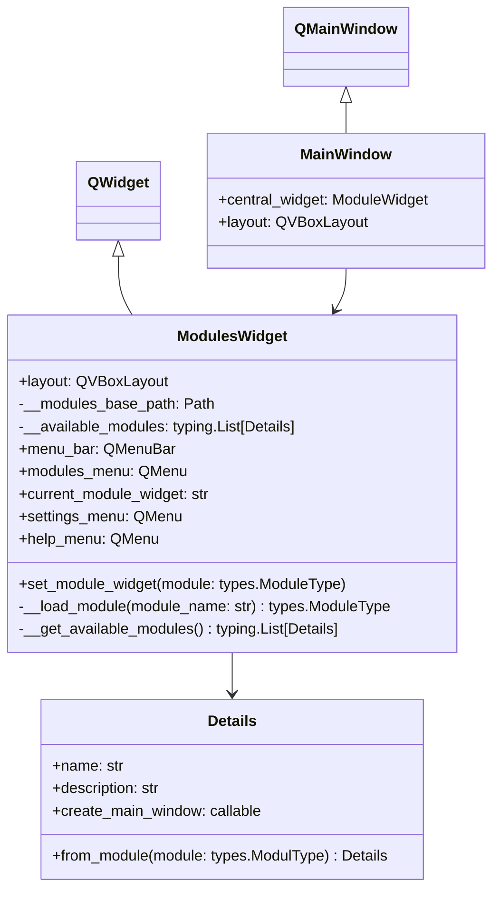

```mermaid
classDiagram
    class QWidget {
        
    }
    
    QWidget <|-- ModulesWidget 
    
    class ModulesWidget {
        +layout: QVBoxLayout
        -__modules_base_path: Path
        -__available_modules: typing.List[Details]
        +menu_bar: QMenuBar
        +modules_menu: QMenu
        +current_module_widget: str
        +settings_menu: QMenu
        +help_menu: QMenu
        
        +set_module_widget(module: types.ModuleType)
        -__load_module(module_name: str) types.ModuleType
        -__get_available_modules() typing.List[Details]
    }
    
    ModulesWidget --> Details
    
    class Details {
        +name: str
        +description: str
        +create_main_window: callable
        
        +from_module(module: types.ModulType) Details
    }
    
    class QMainWindow {
        
    }
    
    QMainWindow <|-- MainWindow
    MainWindow --> ModulesWidget
    class MainWindow {
        +central_widget: ModuleWidget
        +layout: QVBoxLayout
    }
    
```