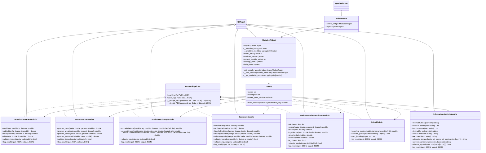

```mermaid
classDiagram
    class QWidget {
        
    }
    
    QWidget <|-- ModulesWidget 
    
    class ModulesWidget {
        +layout: QVBoxLayout
        -__modules_base_path: Path
        -__available_modules: typing.List[Details]
        +menu_bar: QMenuBar
        +modules_menu: QMenu
        +current_module_widget: str
        +settings_menu: QMenu
        +help_menu: QMenu
        
        +set_module_widget(module: types.ModuleType)
        -__load_module(module_name: str) types.ModuleType
        -__get_available_modules() typing.List[Details]
    }
    
    ModulesWidget --> Details
    
    class Details {
        +name: str
        +description: str
        +create_main_window: callable
        
        +from_module(module: types.ModulType) Details
    }
    
    class QMainWindow {
        
    }
    
    QMainWindow <|-- MainWindow
    MainWindow --> ModulesWidget
    class MainWindow {
        +central_widget: ModulesWidget
        +layout: QVBoxLayout
    }
    
    class ProtokollSpeicher {
        +load_from(p: Path) JSON
        +save_to(p: Path, Data: JSON)
        -__encript_AES(password: str, Data: JSON) str|binary
        -__decript_AES(password: str, Data: str|binary) JSON
    }
    
    class GrundrechenartenModule {
        +addition(a: double, b: double) double
        +subtraktion(a: double, b: double) double
        +multiplikation(a: double, b: double) double
        +division(a: double, b: double) double
        +validate_inputs(inputs: List[double]) bool
        +log_result(input: JSON, output: JSON)
    }

    class ProzentRechenModule {
        +prozent_dazu(basis: double, prozent: double) double
        +prozent_weg(basis: double, prozent: double) double
        +prozent_davon(basis: double, prozent: double) double
        +prozent_satz(anteil: double, basis: double) double
        +validate_inputs(inputs: List[double]) bool
        +log_result(input: JSON, output: JSON)
    }

    class KreditBerechnungModule {
        +monatlicheRate(kreditbetrag: double, zinssatz: double, laufzeit: int) double
        +gesamtZinsen(kreditbetrag: double, zinssatz: double, laufzeit: int) double
        +restschuld(kreditbetrag: double, zinssatz: double, laufzeit: int, gezahlteMonate: int) double
        +validate_inputs(inputs: List[double]) bool
        +log_result(input: JSON, output: JSON)
    }

    class GeometrieModule {
        +flaecheKreis(radius: double) double
        +umfangKreis(radius: double) double
        +flaecheRechteck(laenge: double, breite: double) double
        +umfangRechteck(laenge: double, breite: double) double
        +volumenQuader(laenge: double, breite: double, hoehe: double) double
        +validate_triangle(a: double, b: double, c: double) bool
        +validate_inputs(inputs: List[double]) bool
        +log_result(input: JSON, output: JSON)
    }

    class MathematischeFunktionenModule {
        +fakultaet(n: int) int
        +potenz(basis: double, exponent: double) double
        +wurzel(wert: double) double
        +logarithmus(wert: double, basis: double) double
        +sinus(winkel: double) double
        +cosinus(winkel: double) double
        +is_prime(n: int) bool
        +validate_inputs(inputs: List[double]) bool
        +log_result(input: JSON, output: JSON)
    }

    class SchulModule {
        +berechne_durchschnitt(notensammlung: List[int]) double
        +validate_grades(notensammlung: List[int]) bool
        +error_handling(input: str) str
        +log_result(input: JSON, output: JSON)
    }

    class InformationstechnikModule {
        +dezimalZuBinär(wert: int) string
        +binärZuDezimal(wert: string) int
        +hexZuDezimal(wert: string) int
        +dezimalZuHex(wert: int) string
        +asciiZuText(code: string) string
        +textZuAscii(text: string) string
        +calculate_storage(breite: int, hoehe: int, farbtiefe: int, fps: int) string
        +convert_numbers(number: int, base: str) string
        +validate_inputs(inputs: List[Union[int, str]]) bool
        +log_result(input: JSON, output: JSON)
    }

    ProtokollSpeicher <.. GrundrechenartenModule
    ProtokollSpeicher <.. ProzentRechenModule
    ProtokollSpeicher <.. KreditBerechnungModule
    ProtokollSpeicher <.. GeometrieModule
    ProtokollSpeicher <.. MathematischeFunktionenModule
    ProtokollSpeicher <.. SchulModule
    ProtokollSpeicher <.. InformationstechnikModule

    QWidget <|-- GrundrechenartenModule
    QWidget <|-- ProzentRechenModule
    QWidget <|-- KreditBerechnungModule
    QWidget <|-- GeometrieModule
    QWidget <|-- MathematischeFunktionenModule
    QWidget <|-- SchulModule
    QWidget <|-- InformationstechnikModule
    
    Details --> GrundrechenartenModule
    Details --> ProzentRechenModule
    Details --> KreditBerechnungModule
    Details --> GeometrieModule
    Details --> MathematischeFunktionenModule
    Details --> SchulModule
    Details --> InformationstechnikModule    
```